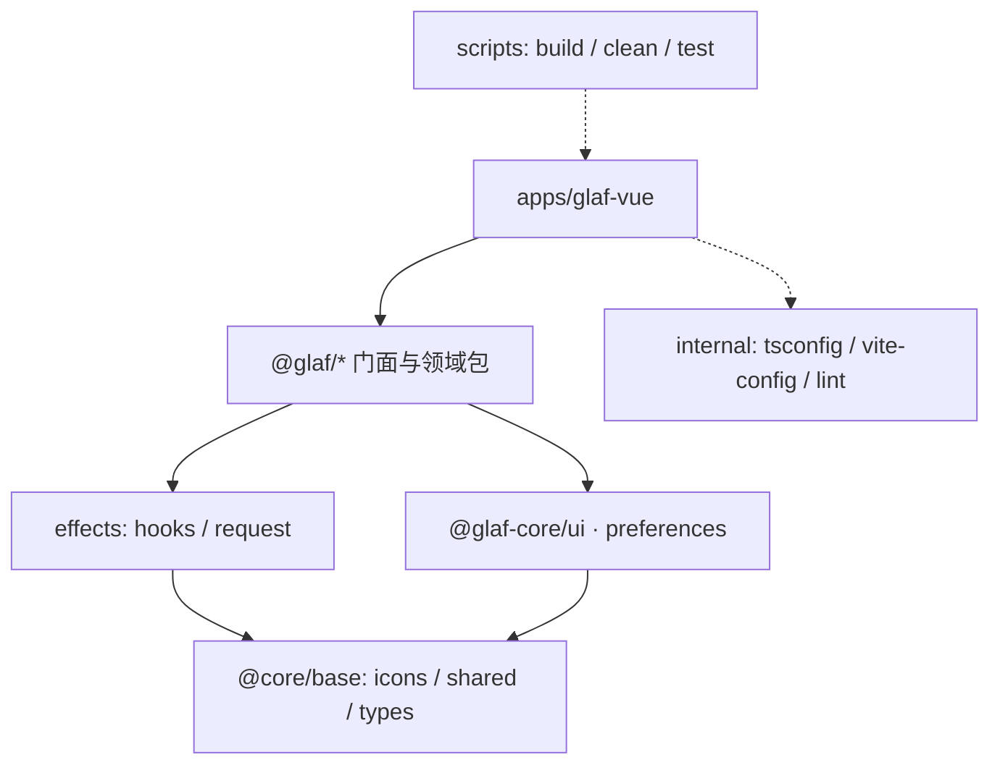
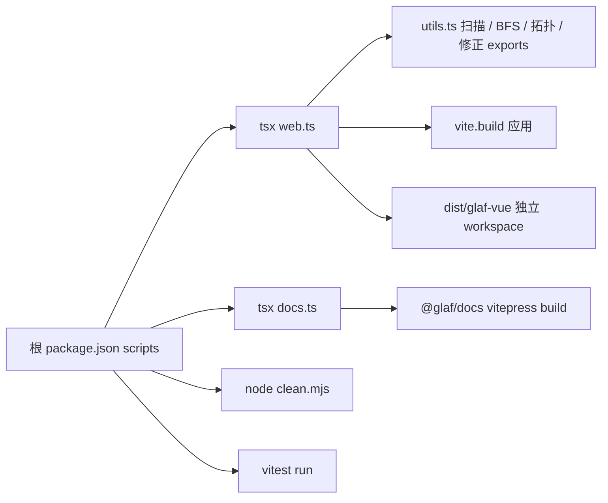
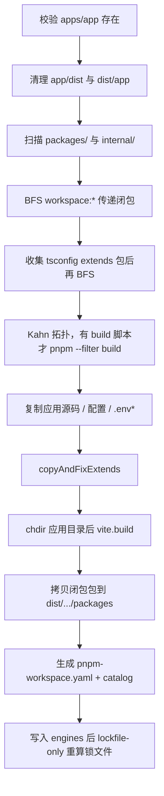

# Vue 3 + Vite Monorepo 项目搭建笔记

以本仓库 **Glaf UI**（根包名 `monorepo_test`）为范例：一边讲 **pnpm + Vue 3 + Vite** Monorepo 的通用原则，一边给出可复制的真实文件。目标是从空目录搭出同一套结构，并理解每个配置为什么这样写。

项目「是什么、模块约束、怎么用」见 [`PROJECT.md`](./PROJECT.md) 与 [`docs/src/guide/`](./docs/src/guide/)。本文只讲 **怎么搭**。

---

## 1. 前言：目标与技术栈

### 1.1 要搭什么

一套 **单应用 + 组件库 + 文档站** 的 Vue 3 pnpm Monorepo：

- 应用：`apps/glaf-vue`（`@glaf/glaf-vue`）可独立 `vite` 开发与构建
- 共享包：`packages/` 分层（`@glaf-core/*` 零业务底层，`@glaf/*` 门面 / 领域）
- 工程：`internal/` 共享 tsconfig / Vite / Prettier，不对外发布
- 脚本：`scripts/` 负责独立项目提取、文档打包、清理、统一测试
- 文档：`docs`（VitePress）

**原则（泛化）：** `apps/` 放可独立部署的应用，`packages/` 放可复用库，`internal/` 放仅本仓库使用的工程配置。本仓没有 Turborepo / Nx / Changesets，用 `pnpm -F` 过滤 + 自研 `scripts/` 代替。

### 1.2 本仓技术栈

| 类别 | 技术 |
| --- | --- |
| 框架 | Vue 3.5、TypeScript 5.9 |
| 包管理 | pnpm 10 workspace + **catalog** |
| 构建 | Vite 7（应用 / 多数 UI 库）、unbuild（纯 TS / Node 工具包） |
| UI | Ant Design Vue 3.2、Less |
| 状态 | Pinia 3、`pinia-plugin-persistedstate` |
| 请求 | Axios（`@glaf/request`） |
| 文档 | VitePress 1.6 |
| 测试 | Vitest 3 + happy-dom |
| 格式化 | Prettier（`@glaf/prettier-config`） |

### 1.3 环境要求

根 [`package.json`](./package.json) 锁定：

```json
{
  "engines": {
    "node": ">=24.14.0",
    "pnpm": ">=10.30.0"
  },
  "packageManager": "pnpm@10.30.2"
}
```

启用 pnpm（任选一种）：

```bash
corepack enable
corepack prepare pnpm@10.30.2 --activate
```

---

## 2. 架构总览

### 2.1 依赖方向

低层不能依赖高层，禁止循环依赖：

```text
apps  →  @glaf/* 业务包 / 门面  →  @core/ui · preferences · effects
                              →  @core/base（icons / shared / types）
internal · scripts · docs 不参与运行时依赖环
```



全仓约束：

- `packages/**` 禁止 `/@/*`、`/#/*`。包内用相对路径；跨包只用 `@glaf/*` / `@glaf-core/*` **公共入口**，禁止 deep import 对方 `src/`。
- 第三方依赖用 `catalog:`，工作区包用 `workspace:*`。**禁止包依赖 `apps/*`**。
- `@core/base` **禁止** `workspace:*`，只能依赖 npm / catalog。
- 组件实现写在 `@glaf-core/ui`，应用与其他包从 `@glaf/ui` 导入。
- `apps/**` 可以使用 `/@/`（应用 `src/`）和 `/#/`（应用 `types/`）。

新功能落点（与 [`docs/src/guide/structure.md`](./docs/src/guide/structure.md) 一致）：

| 新功能 | 写入 |
| --- | --- |
| 通用按钮 / 输入框 / Modal | 实现 `@glaf-core/ui`，由 `@glaf/ui` 再导出 |
| 多包复用的工具函数 | `@glaf/utils`；纯底层进 `@glaf-core/shared` |
| SSE / 拦截器 | `@glaf/request` |
| 某个页面的 URL 封装 | `apps/glaf-vue/src/api/` |
| 字典 / 登录页 | `apps/glaf-vue/src/views/` |
| 聊天工作区 | `@glaf/chat` |
| 流程设计器 | `@glaf/bpmn` |
| 表单设计器 / 布局壳 / i18n | 已有预留包，不要另开平行目录 |

Modal 右下角拖拽缩放的实现细节见文末 [附录 A](#附录-a-modal-右下角拖拽缩放)。

### 2.2 真实目录树

```
monorepo_test/
├── apps/
│   └── glaf-vue/                 # @glaf/glaf-vue  主应用
├── packages/
│   ├── @core/
│   │   ├── base/
│   │   │   ├── icons/            # @glaf-core/icons
│   │   │   ├── shared/           # @glaf-core/shared
│   │   │   └── types/            # @glaf-core/types
│   │   ├── preferences/          # @glaf-core/preferences（预留）
│   │   └── ui/                   # @glaf-core/ui  组件实现
│   ├── bpmn/                     # @glaf/bpmn
│   ├── chat/                     # @glaf/chat
│   ├── constants/                # @glaf/constants
│   ├── effects/
│   │   ├── hooks/                # @glaf/hooks
│   │   ├── request/              # @glaf/request
│   │   ├── layouts/              # @glaf/layouts（预留）
│   │   └── map/                  # @glaf/map（预留）
│   ├── icons/                    # @glaf/icons
│   ├── stores/                   # @glaf/stores
│   ├── types/                    # @glaf/types
│   ├── ui/                       # @glaf/ui  统一出口
│   ├── utils/                    # @glaf/utils
│   ├── styles/                   # @glaf/styles
│   ├── form-design/              # 预留
│   ├── locales/                  # 预留
│   ├── media/                    # 预留
│   └── view-design/              # 预留
├── internal/
│   ├── lint-configs/
│   │   ├── prettier-config/      # @glaf/prettier-config
│   │   └── stylelint-config/     # @glaf/stylelint-config
│   ├── node-utils/               # @glaf/node-utils
│   ├── tsconfig/                 # @glaf/tsconfig
│   └── vite-config/              # @glaf/vite-config
├── scripts/
│   ├── build/                    # @glaf/build
│   ├── clean/                    # clean.mjs（无 package.json）
│   └── test/                     # @glaf/test
├── docs/                         # @glaf/docs
├── package.json
├── pnpm-workspace.yaml
└── pnpm-lock.yaml
```

**原则：** 本仓 **没有** 根 `tsconfig.json`、`turbo.json`、`.changeset/`。TypeScript 共享配置在 `internal/tsconfig`。`examples/` 不在 workspace 内。

---

## 3. 从零搭建（可复制步骤）

按依赖从底向上：先工作区与内部工程包，再 `@core`，再门面 / 领域包，最后应用与脚本。

### 步骤 1：初始化根工程

```bash
mkdir monorepo_test && cd monorepo_test
pnpm init
```

根 `package.json` 最小骨架（完整字段见 [第 5 章](#5-packagejson-文件说明)）：

```json
{
  "name": "monorepo_test",
  "version": "1.0.0",
  "private": true,
  "type": "module",
  "scripts": {
    "dev": "pnpm -F @glaf/glaf-vue run dev",
    "build": "pnpm -F @glaf/build run build",
    "build:web": "pnpm -F @glaf/build run build:web",
    "build:docs": "pnpm -F @glaf/build run build:docs",
    "docs:dev": "pnpm -F @glaf/docs run dev",
    "docs:preview": "pnpm -F @glaf/docs run preview",
    "test": "pnpm -F @glaf/test test",
    "test:unit": "pnpm -F @glaf/test test:unit",
    "clean": "node ./scripts/clean/clean.mjs"
  },
  "devDependencies": {
    "@glaf/build": "workspace:*",
    "@glaf/prettier-config": "workspace:*",
    "@glaf/tsconfig": "workspace:*",
    "@glaf/vite-config": "workspace:*",
    "@types/node": "catalog:",
    "typescript": "catalog:",
    "vite": "catalog:",
    "vitest": "catalog:",
    "vue": "catalog:",
    "vue-tsc": "catalog:"
  },
  "engines": {
    "node": ">=24.14.0",
    "pnpm": ">=10.30.0"
  },
  "packageManager": "pnpm@10.30.2",
  "overrides": {
    "axios": "1.13.5"
  }
}
```

`.gitignore` 至少忽略：`node_modules`、`dist`、`.turbo`、`.env.local`。

### 步骤 2：工作区与 catalog

创建 [`pnpm-workspace.yaml`](./pnpm-workspace.yaml)。**pnpm 默认不递归多层目录**，`packages/@core/base/*`、`packages/effects/*`、`internal/lint-configs/*` 必须显式列出，否则这些包进不了 workspace。字段含义见 [第 4 章](#4-pnpm-workspaceyaml-文件说明)。

### 步骤 3：内部工程包（先搭脚手架）

#### 3.1 `@glaf/tsconfig`

```
internal/tsconfig/
├── package.json
├── base.json
├── web.json
├── web-app.json
├── library.json
└── node.json
```

`package.json`：

```json
{
  "name": "@glaf/tsconfig",
  "version": "1.0.0",
  "private": true,
  "type": "module",
  "files": ["base.json", "library.json", "node.json", "web-app.json", "web.json"]
}
```

各 JSON 内容见 [第 6 章](#6-tsconfigjson-文件说明)。子包通过 `"extends": "@glaf/tsconfig/web.json"` 继承，**不需要根 tsconfig.json**。

#### 3.2 `@glaf/prettier-config`

`internal/lint-configs/prettier-config/index.mjs`：

```js
export default {
  endOfLine: 'auto',
  printWidth: 80,
  proseWrap: 'never',
  semi: true,
  singleQuote: true,
  trailingComma: 'all',
};
```

根 `.prettierrc.mjs`：

```js
export { default } from '@glaf/prettier-config';
```

#### 3.3 `@glaf/vite-config`

Node 侧包，用 **unbuild** 产出 `dist/index.mjs`。核心：`defineConfig` 看当前目录有没有 `index.html`——有则 application，无则 library。应用侧：

```ts
import { defineConfig } from '@glaf/vite-config';

export default defineConfig(async () => ({
  application: {},
  vite: { /* 别名、proxy、dedupe 等覆盖 */ },
}));
```

库模式会把 `dependencies` + `peerDependencies` 全部 external。详见 [第 7 章](#7-vite-与-package-exports)。

#### 3.4 `@glaf/node-utils`

给构建脚本用的 Node 工具（读 `package.json`、扫 workspace、`execa`、`rimraf`）。`private: true`，`build: unbuild`。浏览器包不要依赖它。

### 步骤 4：自下而上建业务包

每个包最少：`package.json` + `tsconfig.json` + `src/index.ts`。

**`@core/base` 包（unbuild / 源码子路径导出）** 示例 [`packages/@core/base/shared/package.json`](./packages/@core/base/shared/package.json)：

```json
{
  "name": "@glaf-core/shared",
  "type": "module",
  "scripts": { "build": "pnpm unbuild" },
  "exports": {
    "./utils": {
      "types": "./src/utils/index.ts",
      "development": "./src/utils/index.ts",
      "default": "./dist/utils/index.mjs"
    }
  },
  "dependencies": {
    "dayjs": "catalog:"
  }
}
```

`build.config.ts`：

```ts
import { defineBuildConfig } from 'unbuild';

export default defineBuildConfig({
  clean: true,
  declaration: true,
  failOnWarn: false,
  entries: ['src/cache/index', 'src/utils/index'],
});
```

**门面库 `@glaf/ui`：** 再导出 `@glaf-core/ui` + Ant Design Vue 的 `A*` 包装。`exports.development` 指向 `src/index.ts`，开发期 Vite 直出源码。

**应用 `apps/glaf-vue`：** 依赖全部 `workspace:*` + `catalog:`。`dev` 脚本会先构建若干尚未走 development 条件的包，再启动 Vite（见根命令 `pnpm dev`）。

`tsconfig.json`：

```json
{
  "$schema": "https://json.schemastore.org/tsconfig",
  "extends": "@glaf/tsconfig/web-app.json",
  "compilerOptions": { "baseUrl": "." },
  "references": [{ "path": "./tsconfig.node.json" }],
  "include": ["src/**/*.ts", "src/**/*.tsx", "src/**/*.vue"]
}
```

`tsconfig.node.json` 给 `vite.config.ts` 用，extends `@glaf/tsconfig/node.json`。

### 步骤 5：文档站

`docs` 作为 workspace 包 `@glaf/docs`：

```json
{
  "name": "@glaf/docs",
  "private": true,
  "scripts": {
    "dev": "vitepress dev --host 0.0.0.0 --port 5274",
    "build": "vitepress build",
    "preview": "vitepress preview --host 0.0.0.0 --outDir ../dist/glaf-docs"
  }
}
```

文档 Demo 的 Mock **只允许** 放在 `docs/`，不得进 `@glaf/*` 运行时包。

### 步骤 6：工程脚本

创建 `scripts/build`、`scripts/clean`、`scripts/test`，并保证 `pnpm-workspace.yaml` 含 `scripts/*`。实现见 [第 8 章](#8-scripts-工程脚本可复现)，按该章可以从零写出等价脚本。

### 步骤 7：安装与启动

```bash
pnpm install
pnpm dev          # 主应用
pnpm docs:dev     # 文档站
pnpm test         # 统一单测
```

单包：

```bash
pnpm --filter @glaf/bpmn build
pnpm --filter @glaf/glaf-vue run dev
```

---

## 4. `pnpm-workspace.yaml` 文件说明

工作区清单 + 统一版本目录。本仓真实结构：

```yaml
packages:
  - internal/*
  - internal/lint-configs/*
  - packages/*
  - packages/@core/base/*
  - packages/@core/*
  - packages/effects/*
  - apps/*
  - scripts/*
  - docs

overrides:
  axios: '1.13.5'
  pinia: 'catalog:'
  vue: 'catalog:'

catalog:
  vue: ^3.5.28
  vite: ^7.3.1
  typescript: ^5.9.3
  ant-design-vue: ^3.2.20
  pinia: ^3.0.4
  vue-router: ^4.6.4
  axios: 1.13.5
  vitest: ^3.2.4
  unbuild: ^3.6.1
  vitepress: ^1.6.4
  # …其余依赖见仓库根文件，子包一律写 "vue": "catalog:"
```

| 字段 | 作用 |
| --- | --- |
| `packages` | glob 列表，命中的目录只要有 `package.json` 就是 workspace 成员 |
| `catalog` | 核心依赖的单一版本源。子包写 `"vue": "catalog:"`，禁止各包锁不同版本 |
| `overrides` | 强制传递依赖版本。`vue` / `pinia` 指回 catalog，避免嵌套装出第二份 |

**原则：** 多层目录必须各写一条 glob。`packages/*` 只能匹配 `packages/ui`，匹配不到 `packages/@core/base/shared`。

**泛化：** pnpm 还支持多个 named catalog（`catalogs:`）。本仓只用默认 `catalog`。也可用 `.npmrc` 配镜像与 hoist，本仓未提交 `.npmrc`。

---

## 5. `package.json` 文件说明

### 5.1 根包

| 字段 | 本仓用法 |
| --- | --- |
| `private: true` | 根包不可发布 |
| `type: module` | 全仓 ESM |
| `scripts` | 全部转发到子包：`pnpm -F <name> run …` |
| `devDependencies` | 工程公共工具；本地包 `workspace:*`，第三方 `catalog:` |
| `engines` / `packageManager` | CI 与独立产物冻结安装时校验 |
| `overrides` / `resolutions` | 钉死 `axios: 1.13.5`（yarn 风格 `resolutions` 一并写上） |

### 5.2 应用包（`@glaf/glaf-vue`）

- 无 `exports` / `main`（不是库）
- `dependencies`：业务包 `workspace:*`，运行时库 `catalog:`
- `dev` 会先 `pnpm --filter <pkg> build` 若干包（icons、stores、ui、vite-config 等），再 `vite`

### 5.3 库包

典型 `exports`（开发走源码，生产走 dist）：

```json
{
  "exports": {
    ".": {
      "types": "./src/index.ts",
      "development": "./src/index.ts",
      "default": "./dist/index.js"
    }
  }
}
```

内部工程包一律 `"private": true`。可发布的 `@glaf-core/*` 可不标 private，但本仓目前以内部使用为主。

### 5.4 三种依赖协议

| 写法 | 何时用 |
| --- | --- |
| `"vue": "catalog:"` | 第三方，版本由根 catalog 统一 |
| `"@glaf/ui": "workspace:*"` | 本仓库另一个包，始终链接本地最新 |
| `"axios": "1.13.5"` | 仅当必须钉死、且不走 catalog 时（根 overrides 已覆盖 axios） |

**禁止** 在子包里写死 `vue: ^3.x` 而绕开 catalog，否则会出现多份 Vue / Pinia。

---

## 6. `tsconfig.json` 文件说明

### 6.1 本仓做法（与旧模板的差别）

泛化教程常在根目录放一份 `tsconfig.json`，再用 `paths: { "@my-monorepo/*": ["./packages/*/src"] }` 做别名。

**本仓不这样做。** 共享配置是 npm 包 `@glaf/tsconfig`，子包：

```json
{
  "extends": "@glaf/tsconfig/web.json",
  "include": ["src"]
}
```

跨包解析靠 `package.json` 的 `name` + `exports`，不靠根 `paths`。这样独立提取到 `dist/glaf-vue` 后仍然能解析。

### 6.2 继承链

```
internal/tsconfig/base.json     严格 ESNext、bundler、noEmit: true
├── node.json                   Node 工具（types: node）
├── web.json                    Vue 包（jsx preserve、vite/client、paths /@/* /#/*）
│   └── web-app.json            应用（再加 vite/client）
└── library.json                要产出 .d.ts 时（declaration、noEmit: false）
```

谁 extends 谁：

| 消费者 | extends |
| --- | --- |
| `apps/glaf-vue/tsconfig.json` | `@glaf/tsconfig/web-app.json` |
| `apps/glaf-vue/tsconfig.node.json` | `@glaf/tsconfig/node.json` |
| 多数 `packages/*` | `@glaf/tsconfig/web.json` |
| `internal/vite-config`、`scripts/*` | `@glaf/tsconfig/node.json` |

`web.json` 里的 `paths`：

```json
{
  "paths": {
    "/@/*": ["src/*"],
    "/#/*": ["types/*"]
  }
}
```

**仅应用代码允许使用。** `packages/**` 必须相对路径或包名导入。Vite 侧应用配置要同步 alias，见 [第 7 章](#7-vite-与-package-exports)。

### 6.3 可复制的共享 JSON

**`base.json`：**

```json
{
  "display": "Base",
  "compilerOptions": {
    "composite": false,
    "target": "ESNext",
    "moduleDetection": "force",
    "experimentalDecorators": true,
    "baseUrl": ".",
    "module": "ESNext",
    "moduleResolution": "bundler",
    "resolveJsonModule": true,
    "strict": true,
    "strictNullChecks": true,
    "noFallthroughCasesInSwitch": true,
    "noImplicitAny": true,
    "noImplicitOverride": true,
    "noImplicitThis": true,
    "noUncheckedIndexedAccess": true,
    "noUnusedLocals": true,
    "noUnusedParameters": true,
    "inlineSources": false,
    "noEmit": true,
    "removeComments": true,
    "sourceMap": false,
    "allowSyntheticDefaultImports": true,
    "esModuleInterop": true,
    "forceConsistentCasingInFileNames": true,
    "isolatedModules": true,
    "verbatimModuleSyntax": true,
    "skipLibCheck": true,
    "preserveWatchOutput": true
  },
  "exclude": ["**/node_modules/**", "**/dist/**", "**/.turbo/**"]
}
```

**`web.json`：** extends `./base.json`，补 `jsx: preserve`、`jsxImportSource: vue`、`lib: ["ESNext","DOM","DOM.Iterable"]`、`types: ["vite/client"]`、上述 `paths`。

**`web-app.json`：** extends `./web.json`，再声明 `types: ["vite/client"]`。

**`node.json`：** extends `./base.json`，`lib: ["ESNext"]`，`types: ["node"]`。

**`library.json`：** extends `./base.json`，`declaration: true`，`noEmit: false`（需要 tsc 出 d.ts 时用；本仓多数 UI 库用 `vite-plugin-dts`）。

### 6.4 常用关键字（泛化）

| 关键字 | 功能 | 本仓典型用法 |
| --- | --- | --- |
| `$schema` | 编辑器补全 | 子包 tsconfig 可加 `https://json.schemastore.org/tsconfig` |
| `extends` | 继承另一份配置 | 全部子包 extends `@glaf/tsconfig/...` |
| `display` | 人类可读标识 | `base.json` 里 `"Base"` |
| `compilerOptions` | 编译选项 | 公共项放 base，子包少覆盖 |
| `include` / `exclude` | 编译范围 | 库 `"include": ["src"]`；应用包含 `*.vue` |
| `references` | 项目引用 | 应用引用 `tsconfig.node.json` |
| `files` | 单文件列表 | Monorepo 少用 |

`compilerOptions` 子集：

| 选项 | 作用 |
| --- | --- |
| `moduleResolution: "bundler"` | 识别 `package.json` 的 `exports` / `imports`，Vite 推荐 |
| `verbatimModuleSyntax` | `import type` 必须显式，避免运行时多带类型 |
| `noEmit: true` | 开发只做类型检查，产物交给 Vite / unbuild |
| `declaration` | 库需要 `.d.ts` 时打开 |
| `jsx: "preserve"` | 留给 `@vitejs/plugin-vue-jsx` |
| `paths` | 必须与 Vite `resolve.alias` 一致 |

调试：

```bash
npx tsc --showConfig
npx tsc --noEmit --diagnostics
```

---

## 7. Vite 与 package exports

### 7.1 共享 `defineConfig`

[`internal/vite-config/src/config/index.ts`](./internal/vite-config/src/config/index.ts) 逻辑：

```ts
function defineConfig(userConfigPromise, type = 'auto') {
  let projectType = type;
  if (projectType === 'auto') {
    const htmlPath = join(process.cwd(), 'index.html');
    projectType = existsSync(htmlPath) ? 'application' : 'library';
  }
  return projectType === 'application'
    ? defineApplicationConfig(userConfigPromise)
    : defineLibraryConfig(userConfigPromise);
}
```

因此 **`scripts/build` 在调用 `vite.build` 前必须 `chdir` 到应用目录**，否则会被当成 library。

库模式默认：`formats: ['es']`，external 全部 `dependencies` + `peerDependencies`。

### 7.2 应用覆盖

[`apps/glaf-vue/vite.config.ts`](./apps/glaf-vue/vite.config.ts)：

- 别名 `/@/` → `src/`，`/#/` → `types/`
- `dedupe: ['vue', 'pinia']`，避免 workspace 嵌套装出第二份 Pinia
- 开发代理 `/gzgi_web` → 后端（生产不会带上，需在网关配置等价规则）

### 7.3 库自写 Vite（组件包）

部分包（`@glaf-core/ui`、`@glaf/ui`）不走共享 library 工厂，自己写 `vite.config.ts`。必须把 `vue`、`pinia`、`@glaf/stores` 及工作区包 **external**，否则 `getActivePinia()` 读不到宿主 `app.use(pinia)` 的那一份。

开发期配合：

```ts
resolve: { conditions: ['development'] }
```

与 `exports.development` 一起，Vite 解析到 `src/index.ts`。仍有部分包（icons 等）在 `pnpm dev` 里先 build。

### 7.4 unbuild vs Vite lib

| 场景 | 工具 |
| --- | --- |
| Vue SFC / Less / 组件库 | Vite lib + `vite-plugin-dts`，必要时 `css-injected-by-js` |
| 纯 TS（shared、types、node-utils、vite-config） | unbuild |
| 源码直出（constants、部分 chat） | 无 build 脚本，`exports` 指向 `src` |

---

## 8. `scripts/` 工程脚本（可复现）

没有 Turbo 时，这三套脚本就是「整仓构建 / 独立交付 / 统一测试」的替代。根脚本映射：

| 根命令 | 实际入口 |
| --- | --- |
| `pnpm build` | `tsx scripts/build/src/build.ts`——**几乎为空，不要当完整流水线** |
| `pnpm build:web` | `tsx scripts/build/src/web.ts`（独立项目提取，默认 `@glaf/glaf-vue`） |
| `pnpm build:docs` | `tsx scripts/build/src/docs.ts` |
| `pnpm test` / `test:unit` | `@glaf/test` 的 `vitest run` |
| `pnpm clean` | `node ./scripts/clean/clean.mjs`（**不是** workspace 包） |



### 8.1 `@glaf/build` 脚手架

```
scripts/build/
├── package.json
├── tsconfig.json          # extends @glaf/tsconfig/node.json
└── src/
    ├── build.ts           # 空入口（保留给将来）
    ├── web.ts             # 独立 Web 提取
    ├── docs.ts            # 文档站
    └── utils.ts           # 扫描 / 闭包 / 拓扑 / 修正
```

`package.json`：

```json
{
  "name": "@glaf/build",
  "version": "1.0.0",
  "private": true,
  "type": "module",
  "scripts": {
    "build": "tsx src/build.ts @glaf/glaf-vue",
    "build:web": "tsx src/web.ts @glaf/glaf-vue",
    "build:docs": "tsx src/docs.ts"
  },
  "devDependencies": {
    "@types/node": "catalog:",
    "fs-extra": "^11.2.0",
    "tsx": "catalog:",
    "typescript": "catalog:",
    "vite": "catalog:"
  }
}
```

`tsx` 直接跑 TypeScript，无需先编译。根目录解析：

```ts
import { fileURLToPath } from 'node:url';
import path from 'node:path';

const __dirname = path.dirname(fileURLToPath(import.meta.url));
export const rootDir = path.resolve(__dirname, '../../../');
```

目标应用：`process.argv[2]` → `npm_lifecycle_event` 匹配 `build:(.+)` → 默认 `@glaf/glaf-vue`。目录名去掉 scope：`@glaf/glaf-vue` → `apps/glaf-vue`，输出 `dist/glaf-vue/`。

### 8.2 `build:web` 流水线

产物是 **可二次开发的独立 pnpm workspace**，不是只有静态 `assets/`。验收请安装并启动 `dist/glaf-vue/`，不要手改生成目录；问题回 monorepo 源码或 `scripts/build` 修完再跑。



逐步行为（与 [`web.ts`](./scripts/build/src/web.ts) 一致）：

1. 没有 `apps/<appDirName>` 则抛错。
2. 删除 `apps/<app>/dist` 与 `dist/<app>/`。
3. `scanPackagesFromDir` 递归：发现 `package.json` 就记入 `Map<name, { sourcePath, pkgJson }>`。合并 `packages/` 与 `internal/`（同名以 packages 为准）。
4. `getWorkspaceDeps`：应用 `dependencies` + `devDependencies` 里值为 `workspace:*` 的名字。
5. `collectAllWorkspacePackages`：从上述名单 BFS，只跟踪 `workspace:*` 且已在 Map 中的包。
6. 若应用有 `tsconfig.json`：拷到输出目录，`collectExtendsPackages` 识别 `@glaf/tsconfig/...` 这类包名，并入闭包后再 BFS 一次。
7. `topologicalSort`（Kahn）。仅当 `scripts.build` 存在时执行 `pnpm --filter=<name> run build`。成环抛错。
8. 复制 `index.html`、`package.json`、`tsconfig.json`、`tsconfig.node.json`、`vite.config.ts`、`src/`、`public/`、所有 `.env*`。
9. `copyAndFixExtends`：相对路径 extends 拷进 dist 并改成相对路径；**包名 extends 不拷 JSON 文件**，靠把该包打进 `packages/`。
10. 记下 `cwd`，`process.chdir(appDir)`，`vite.build({ root: appDir, configFile, build.outDir: appDist })`，`finally` 恢复 cwd。
11. 闭包包拷到 `dist/<app>/packages/`：
    - `internal/` → `packages/internal/<relative>`
    - 其余 → `packages/<pkgName>`（如 `packages/@glaf/ui`）
    - 非空 `dist/` 拷产物，否则拷 `src` + 根文件（跳过 `node_modules`）
    - `fixPackageJson`：有 dist 则 `./src/*.ts` → `./dist/*.js` / `.d.ts`，删除 `exports.development`
    - **`catalog:` 与 `workspace:*` 原样保留**（不以 `file:` 替换；若与其他文档冲突，以本脚本为准）
12. `extractCatalogFromRoot` + `generatePackagesPatterns` 写独立 `pnpm-workspace.yaml`。应用 scripts 改为 `dev: pnpm vite`、`build: vite build`。拷根 `engines` / `packageManager` / `overrides` / `resolutions`。
13. 在产物目录执行 `pnpm install --lockfile-only --no-frozen-lockfile --prefer-offline`。importer 路径已变，**不能直接复用根 lockfile**。

**踩坑：** 空 `dist/` 视为未构建；Vite 前必须 chdir；`pnpm build`（空 `build.ts`）≠ `pnpm build:web`。

### 8.3 `utils.ts` 核心算法（可粘贴）

以下与源码等价，省略部分日志。完整版见 [`scripts/build/src/utils.ts`](./scripts/build/src/utils.ts)。

```ts
import fs from 'fs-extra';
import path from 'path';
import { fileURLToPath } from 'url';

const __dirname = path.dirname(fileURLToPath(import.meta.url));
export const rootDir = path.resolve(__dirname, '../../../');

export async function extractCatalogFromRoot(): Promise<string[]> {
  const rootWorkspace = path.join(rootDir, 'pnpm-workspace.yaml');
  if (!(await fs.pathExists(rootWorkspace))) return [];
  const lines = (await fs.readFile(rootWorkspace, 'utf-8')).split(/\r?\n/);
  const catalogLines: string[] = [];
  let inCatalog = false;
  for (const line of lines) {
    if (!inCatalog && /^catalog\s*:\s*$/.test(line)) {
      inCatalog = true;
      continue;
    }
    if (inCatalog) {
      if (/^\s*[^\s]/.test(line) && !/^\s{2,}/.test(line)) break;
      const match = line.match(/^\s{2}([^:\s]+):\s*(.+)$/);
      if (match) {
        const key = match[1].replace(/^['"]|['"]$/g, '');
        catalogLines.push(`  '${key}': ${match[2]}`);
      }
    }
  }
  return catalogLines;
}

export async function generatePackagesPatterns(outDist: string): Promise<string[]> {
  const packagesDir = path.join(outDist, 'packages');
  const patterns = new Set<string>();

  async function scan(dir: string) {
    const entries = await fs.readdir(dir, { withFileTypes: true });
    for (const entry of entries) {
      if (!entry.isDirectory()) continue;
      const fullPath = path.join(dir, entry.name);
      if (await fs.pathExists(path.join(fullPath, 'package.json'))) {
        const parts = path.relative(outDist, fullPath).split(path.sep);
        if (parts.length === 2 || parts.length === 1) patterns.add(`${parts[0]}/*`);
        else if (parts.length === 3) patterns.add(`${parts[0]}/*/*`);
      }
      await scan(fullPath);
    }
  }

  if (await fs.pathExists(packagesDir)) await scan(packagesDir);
  if (patterns.size === 0) {
    patterns.add('packages/*');
    patterns.add('packages/*/*');
  }
  return Array.from(patterns);
}

export async function fixPackageJson(
  pkgJsonPath: string,
  isPackage = false,
  hasDist = true,
) {
  if (!(await fs.pathExists(pkgJsonPath))) return;
  const pkgJson = JSON.parse(await fs.readFile(pkgJsonPath, 'utf-8'));
  let modified = false;

  if (isPackage && hasDist && pkgJson.exports) {
    for (const exp of Object.values(pkgJson.exports) as Array<Record<string, string>>) {
      if (!exp || typeof exp !== 'object') continue;
      const rewrite = (v: string, ext: string) =>
        v.startsWith('./src/') ? v.replace('./src/', './dist/').replace(/\.ts$/, ext) : v;
      if (exp.types?.startsWith('./src/')) {
        exp.types = rewrite(exp.types, '.d.ts');
        modified = true;
      }
      for (const key of ['default', 'import', 'require'] as const) {
        if (exp[key]?.startsWith('./src/')) {
          exp[key] = rewrite(exp[key], '.js');
          modified = true;
        }
      }
      if ('development' in exp) {
        delete exp.development;
        modified = true;
      }
    }
  }

  if (modified) await fs.writeFile(pkgJsonPath, JSON.stringify(pkgJson, null, 2));
}

export async function scanPackagesFromDir(dir: string) {
  const map = new Map<string, { sourcePath: string; pkgJson: any }>();
  if (!(await fs.pathExists(dir))) return map;

  async function scan(currentDir: string) {
    const entries = await fs.readdir(currentDir, { withFileTypes: true });
    for (const entry of entries) {
      if (!entry.isDirectory()) continue;
      const pkgDir = path.join(currentDir, entry.name);
      const pkgJsonPath = path.join(pkgDir, 'package.json');
      if (await fs.pathExists(pkgJsonPath)) {
        const pkgJson = JSON.parse(await fs.readFile(pkgJsonPath, 'utf-8'));
        if (pkgJson.name) map.set(pkgJson.name, { sourcePath: pkgDir, pkgJson });
      }
      await scan(pkgDir);
    }
  }

  await scan(dir);
  return map;
}

export async function getAllWorkspacePackages() {
  const internalMap = await scanPackagesFromDir(path.join(rootDir, 'internal'));
  const packagesMap = await scanPackagesFromDir(path.join(rootDir, 'packages'));
  return new Map([...internalMap, ...packagesMap]);
}

export async function getWorkspaceDeps(appDir: string) {
  const appPkg = JSON.parse(await fs.readFile(path.join(appDir, 'package.json'), 'utf-8'));
  const allDeps = { ...appPkg.dependencies, ...appPkg.devDependencies };
  return Object.entries(allDeps)
    .filter(([, version]) => version === 'workspace:*')
    .map(([name]) => name);
}

export async function collectAllWorkspacePackages(
  packagesMap: Map<string, any>,
  startPackages: string[],
) {
  const resultSet = new Set(startPackages);
  const queue = [...startPackages];
  while (queue.length) {
    const pkgName = queue.shift()!;
    const pkg = packagesMap.get(pkgName);
    if (!pkg) continue;
    for (const [depName, version] of Object.entries(pkg.pkgJson.dependencies || {})) {
      if (version === 'workspace:*' && packagesMap.has(depName) && !resultSet.has(depName)) {
        resultSet.add(depName);
        queue.push(depName);
      }
    }
  }
  return Array.from(resultSet);
}

export function topologicalSort(packagesMap: Map<string, any>, packagesToBuild: string[]) {
  const graph = new Map<string, string[]>();
  const inDegree = new Map<string, number>();
  for (const pkgName of packagesToBuild) {
    graph.set(pkgName, []);
    inDegree.set(pkgName, 0);
  }
  for (const pkgName of packagesToBuild) {
    const deps = packagesMap.get(pkgName)?.pkgJson?.dependencies || {};
    for (const [depName, version] of Object.entries(deps)) {
      if (version === 'workspace:*' && packagesToBuild.includes(depName)) {
        graph.get(depName)!.push(pkgName);
        inDegree.set(pkgName, (inDegree.get(pkgName) || 0) + 1);
      }
    }
  }
  const queue = [...inDegree.entries()].filter(([, d]) => d === 0).map(([n]) => n);
  const order: string[] = [];
  while (queue.length) {
    const node = queue.shift()!;
    order.push(node);
    for (const neighbor of graph.get(node)!) {
      const next = inDegree.get(neighbor)! - 1;
      inDegree.set(neighbor, next);
      if (next === 0) queue.push(neighbor);
    }
  }
  if (order.length !== packagesToBuild.length) {
    throw new Error('Circular dependency detected among workspace packages');
  }
  return order;
}

export async function collectExtendsPackages(
  tsconfigPath: string,
  allPackagesMap: Map<string, any>,
) {
  const packages = new Set<string>();
  async function processExtends(filePath: string) {
    if (!(await fs.pathExists(filePath))) return;
    const extendsValue = JSON.parse(await fs.readFile(filePath, 'utf-8')).extends;
    if (!extendsValue) return;
    if (extendsValue.startsWith('@') || !extendsValue.includes('/')) {
      const pkgName = extendsValue.split('/').slice(0, 2).join('/');
      if (allPackagesMap.has(pkgName)) packages.add(pkgName);
    } else {
      await processExtends(path.resolve(path.dirname(filePath), extendsValue));
    }
  }
  await processExtends(tsconfigPath);
  return Array.from(packages);
}
```

`copyAndFixExtends`：只处理相对路径 `extends`；把文件按相对仓库根的结构拷到 dist，并把 `extends` 改成 dist 内相对路径（统一 `/`）。包名形式（`@glaf/tsconfig/web-app.json`）不走这条路径。

`web.ts` 主流程按 8.2 的 13 步编排即可，关键片段：

```ts
process.chdir(appDir);
try {
  await viteBuild({
    root: appDir,
    configFile: path.join(appDir, 'vite.config.ts'),
    build: { outDir: appDist, emptyOutDir: true, sourcemap: false },
  });
} finally {
  process.chdir(originalCwd);
}

execSync('pnpm install --lockfile-only --no-frozen-lockfile --prefer-offline', {
  cwd: outDist,
  stdio: 'inherit',
});
```

### 8.4 `build:docs`（完整等价）

```ts
import { execSync } from 'child_process';
import fs from 'fs-extra';
import path from 'path';
import { rootDir } from './utils.js';

const docsDir = path.join(rootDir, 'docs');
const outDist = path.join(rootDir, 'dist', 'glaf-docs');

async function build() {
  if (!(await fs.pathExists(docsDir))) {
    throw new Error(`Docs directory not found: ${docsDir}`);
  }
  await fs.remove(outDist);
  execSync('pnpm --filter=@glaf/docs run build', {
    stdio: 'inherit',
    cwd: rootDir,
    env: { ...process.env, NODE_ENV: 'production' },
  });
  if (!(await fs.pathExists(path.join(outDist, 'index.html')))) {
    throw new Error(`Docs build failed: missing index.html`);
  }
}

build().catch((err) => {
  console.error(err);
  process.exit(1);
});
```

子路径部署：`DOCS_BASE=/glaf-docs/ pnpm build:docs`（由 VitePress 读取）。产物是纯静态目录，无需在服务器上再 `pnpm install`。

### 8.5 `scripts/clean`（完整等价）

**没有** `package.json`。根脚本：`"clean": "node ./scripts/clean/clean.mjs"`。

行为：从 `process.cwd()` 递归删除名为 `node_modules` / `dist` / `.turbo` / `dist.zip` 的项；`--del-lock` 再删 `pnpm-lock.yaml`。跳过 `.git` / `.idea` / `.vscode` / `.DS_Store`；深度上限 10；每批并发 10；`ENOENT` 忽略。

```js
import { promises as fs } from 'node:fs';
import { join, normalize } from 'node:path';

const rootDir = process.cwd();
const CONCURRENCY_LIMIT = 10;
const SKIP_DIRS = new Set(['.DS_Store', '.git', '.idea', '.vscode']);

async function processItem(currentDir, item, targets) {
  if (SKIP_DIRS.has(item)) return false;
  try {
    const itemPath = normalize(join(currentDir, item));
    if (targets.includes(item)) {
      await fs.rm(itemPath, { force: true, recursive: true });
      console.log(`Deleted: ${itemPath}`);
      return false;
    }
    return true;
  } catch (error) {
    if (error.code !== 'ENOENT') {
      console.error(`Error handling ${item} in ${currentDir}: ${error.message}`);
    }
    return false;
  }
}

async function cleanTargetsRecursively(currentDir, targets, depth = 0) {
  if (depth > 10) return;
  let dirents;
  try {
    dirents = await fs.readdir(currentDir, { withFileTypes: true });
  } catch {
    return;
  }
  for (let i = 0; i < dirents.length; i += CONCURRENCY_LIMIT) {
    const batch = dirents.slice(i, i + CONCURRENCY_LIMIT);
    await Promise.allSettled(
      batch.map(async (dirent) => {
        const shouldRecurse = await processItem(currentDir, dirent.name, targets);
        if (shouldRecurse && dirent.isDirectory()) {
          await cleanTargetsRecursively(
            normalize(join(currentDir, dirent.name)),
            targets,
            depth + 1,
          );
        }
      }),
    );
  }
}

(async function startCleanup() {
  const targets = ['node_modules', 'dist', '.turbo', 'dist.zip'];
  if (process.argv.includes('--del-lock')) targets.push('pnpm-lock.yaml');
  await cleanTargetsRecursively(rootDir, targets);
})();
```

### 8.6 `@glaf/test` 统一 runner

`scripts/test` 是 runner，**不是用例仓库**。用例写在模块旁：`foo.test.ts` / `foo.spec.ts`，或 `__tests__/`。

`package.json`：

```json
{
  "name": "@glaf/test",
  "private": true,
  "type": "module",
  "scripts": {
    "test": "vitest run",
    "test:unit": "vitest run"
  },
  "devDependencies": {
    "@glaf/tsconfig": "workspace:*",
    "@vitejs/plugin-vue": "catalog:",
    "@vitejs/plugin-vue-jsx": "catalog:",
    "happy-dom": "catalog:",
    "vitest": "catalog:",
    "vue": "catalog:"
  }
}
```

`vitest.config.ts`：

```ts
import { dirname, resolve } from 'node:path';
import { fileURLToPath } from 'node:url';
import Vue from '@vitejs/plugin-vue';
import VueJsx from '@vitejs/plugin-vue-jsx';
import { configDefaults, defineConfig } from 'vitest/config';

const testPkgDir = dirname(fileURLToPath(import.meta.url));
const monorepoRoot = resolve(testPkgDir, '../..');

export default defineConfig({
  plugins: [Vue(), VueJsx()],
  root: monorepoRoot,
  test: {
    dir: monorepoRoot,
    environment: 'happy-dom',
    include: [
      'packages/**/*.{test,spec}.?(c|m)[jt]s?(x)',
      'apps/**/*.{test,spec}.?(c|m)[jt]s?(x)',
    ],
    exclude: [
      ...configDefaults.exclude,
      '**/node_modules/**',
      '**/dist/**',
      '**/e2e/**',
      'example/**',
      'docs/**',
    ],
    setupFiles: [resolve(testPkgDir, 'src/setup.ts')],
    reporters: ['default', resolve(testPkgDir, 'src/value-reporter.ts')],
  },
});
```

断言打印三件套：

**`src/assertion-records.ts`**

```ts
export interface AssertionRecord {
  passed: boolean;
  actual: string;
  expected: string;
}
export const ASSERTION_META_KEY = 'assertionRecords' as const;
export interface AssertionTaskMeta {
  [ASSERTION_META_KEY]?: AssertionRecord[];
}
```

**`src/setup.ts`**：劫持 `chai.Assertion.prototype.assert`，把实际值 / 期望值 `inspect` 后写入 `task.meta`（worker → 主进程）。通过与失败都记录，失败再把原错误抛出。

**`src/value-reporter.ts`**：实现 Vitest `Reporter`，在 `onTestCaseResult` 打印：

```
[PASS] isEmpty > should return true for empty string
  [PASS] 实际值: true
         期望值: true
```

核心：

```ts
class ValueReporter {
  onTestCaseResult(testCase) {
    const { state } = testCase.result();
    if (state === 'skipped' || state === 'pending') return;
    const tag = state === 'passed' ? 'PASS' : 'FAIL';
    const records = testCase.meta()[ASSERTION_META_KEY] ?? [];
    console.log(`\n[${tag}] ${testCase.fullName}`);
    for (const record of records) {
      console.log(`  [${record.passed ? 'PASS' : 'FAIL'}] 实际值: ${record.actual}`);
      console.log(`         期望值: ${record.expected}`);
    }
  }
}
export default ValueReporter;
```

`setup.ts` 拦截逻辑（等价实现）：

```ts
import { inspect } from 'node:util';
import { afterEach, beforeEach, chai } from 'vitest';
import { ASSERTION_META_KEY } from './assertion-records';

let currentRecords = [];
const formatValue = (value) =>
  inspect(value, { breakLength: 80, colors: false, depth: 4, maxArrayLength: 20, maxStringLength: 500 });

beforeEach(() => {
  currentRecords = [];
});
afterEach(({ task }) => {
  task.meta[ASSERTION_META_KEY] = currentRecords;
  currentRecords = [];
});

const originalAssert = chai.Assertion.prototype.assert;
chai.Assertion.prototype.assert = function (expr, msg, negateMsg, expected, actual, showDiff) {
  const actualValue = actual !== undefined ? actual : this._obj;
  try {
    const result = originalAssert.call(this, expr, msg, negateMsg, expected, actual, showDiff);
    currentRecords.push({ passed: true, actual: formatValue(actualValue), expected: formatValue(expected) });
    return result;
  } catch (error) {
    currentRecords.push({
      passed: false,
      actual: formatValue(error.actual !== undefined ? error.actual : actualValue),
      expected: formatValue(error.expected !== undefined ? error.expected : expected),
    });
    throw error;
  }
};
```

单包仍可用 `pnpm -F @glaf/chat test`（该包自己的 vitest）。

---

## 9. 新增一个包的 checklist

1. 在正确分层目录建文件夹（base / 门面 / effects / 领域 / 预留包内，不要平行再开一套）。
2. `package.json`：`name` 用 `@glaf/*` 或 `@glaf-core/*`，`type: module`；第三方 `catalog:`，本地 `workspace:*`。
3. `tsconfig.json`：`extends` `@glaf/tsconfig/web.json` 或 `node.json`，`include: ["src"]`。
4. `exports`：开发 `development` / `types` 指向 `src`，`default` 指向 `dist`（源码直出包可全部指 `src`）。
5. 若需构建：Vite lib（Vue）或 unbuild（纯 TS）；external `vue` / `pinia` / 工作区包。
6. 确认 `pnpm-workspace.yaml` 的 glob 能扫到该目录；`pnpm install` 链接。
7. 应用或门面包加上 `"@glaf/xxx": "workspace:*"`。
8. 有单测则放 `*.test.ts` 在源码旁，走 `pnpm test`。

---

## 10. 与泛化模板的差异

旧笔记 / 社区模板常见、**本仓没有或不同**的点：

| 泛化模板 | 本仓 |
| --- | --- |
| `apps/main-app`、`@my-monorepo/ui` | `apps/glaf-vue`、`@glaf/ui` + `@glaf-core/ui` 两层 |
| 根 `tsconfig.json` + `paths` | `@glaf/tsconfig` 包继承，跨包靠 `exports` |
| `turbo.json` / Nx | `pnpm -F` + `scripts/build` |
| Changesets 发版 | 未接入 |
| `internal/eslint-config` | 无根 ESLint 配置；有 Prettier，Stylelint 包尚未填规则 |
| `.npmrc` hoist | 未提交（可按需自加镜像） |
| Tailwind 落地配置 | catalog 中有 tailwind，无根 `tailwind.config` |
| 多应用 | 目前只有 `glaf-vue` |
| Vue Router 挂到应用 | 依赖里有 router，应用尚未 mount |

预留空包：`layouts`、`map`、`form-design`、`locales`、`media`、`view-design`、`preferences`。新功能进对应目录，不要另开平行包。

---

## 附录 A. Modal 右下角拖拽缩放

补充内容，不影响上文搭建流程。源码：[`packages/@core/ui/src/components/modal`](./packages/@core/ui/src/components/modal)。应用从 `@glaf/ui` 引入。本节只讲 **右下角缩放**；标题栏拖拽、全屏仅作为交叉点：全屏时禁用手柄。

### A.1 为什么不能直接改 DOM 宽高

Ant Design Vue 3 的 `a-modal` 由 Dialog 持续 patch 内联 `style`。缩放时若只写 `el.style.width`，下一帧会被还原。另外 `.ant-modal` 默认 `pointer-events: none`，手柄若放在 modal 内部且不恢复点击，鼠标点不中。

**策略：**

1. 几何由 Vue 持有：`layoutWidth` / `layoutHeight` / `layoutStyle`，再绑到 `width` 与 `dialogStyle`。
2. 手柄用 `modalRender` 插成 content 的**兄弟节点**，避免被 Dialog 补丁丢掉。

### A.2 启用条件与 props

默认 `resizable`、`showResizeHandle` 均为 `true`。实际启用：

```ts
resizable && showResizeHandle && visible && !isFullscreen
```

相关 props（[`props.ts`](./packages/@core/ui/src/components/modal/src/props.ts)）：

| Prop | 默认 | 含义 |
| --- | --- | --- |
| `resizable` | `true` | 是否可通过手柄缩放 |
| `showResizeHandle` | `true` | 是否渲染右下角手柄 |
| `minWidth` / `minHeight` | `300` / `200` | 像素下限 |
| `maxWidth` / `maxHeight` | 无 | 可选上限 |
| `constrainWithinViewport` | `true` | 右 / 下边缘不超出窗口 |
| `fillBodyHeight` | `false` | body 是否吃满标题栏与页脚之间的剩余高度 |
| `defaultWidth` / `defaultHeight` | `520px` / `auto` | 未缩放前的尺寸 |

事件：`resize-start`、`resize-end`。

### A.3 手柄注入（`modalRender`）

```ts
function renderModal({ originVNode }: { originVNode: VNode }) {
  return h('div', { class: 'glaf-modal-shell' }, [
    originVNode,
    showResizeHandleNode.value
      ? h(
          'div',
          {
            class: 'glaf-modal-resize-handle',
            title: '调整大小',
            onMousedown: onResizeStart,
          },
          [h('span', { class: 'glaf-modal-resize-handle-inner' })],
        )
      : null,
  ]);
}
```

把 `renderModal` 传给 `a-modal` 的 `modalRender`。壳与手柄 CSS：

```less
.glaf-modal-shell {
  position: relative;
  height: 100%;
  pointer-events: none; /* 不抢 content 点击；.ant-modal 本身也是 none */
}

.glaf-modal-resize-handle {
  position: absolute;
  right: 0;
  bottom: 0;
  z-index: 10;
  width: 24px;
  height: 24px;
  cursor: se-resize;
  pointer-events: auto; /* 手柄必须显式恢复点击 */
}

.glaf-modal-resize-handle-inner {
  position: absolute;
  right: 6px;
  bottom: 6px;
  width: 10px;
  height: 10px;
  border-right: 2px solid rgba(0, 0, 0, 0.35);
  border-bottom: 2px solid rgba(0, 0, 0, 0.35);
  pointer-events: none;
}

.glaf-modal--resize-handle:not(.glaf-modal--fullscreen) {
  .ant-modal-footer {
    padding-right: 24px; /* 避免挡住确定 / 取消 */
  }
}

.glaf-modal--fullscreen .glaf-modal-resize-handle {
  display: none;
}
```

`wrapClassName` 在非全屏且开启缩放手时加 `glaf-modal--resize-handle`。拖拽 / 缩放过程加 `glaf-modal--dragging`（`user-select: none`，关掉 transition）。

### A.4 首次缩放锁定左上角

antd 默认 `margin: auto` 居中。一开始拖宽高若不改定位，弹窗会「又撑又漂」。首次缩放（或标题栏拖拽）调用 `createLockedLayout`：

```ts
export function createLockedLayout(el: HTMLElement) {
  const rect = el.getBoundingClientRect();
  return {
    locked: true,
    width: `${rect.width}px`,
    style: {
      position: 'absolute',
      left: `${rect.left}px`,
      top: `${rect.top}px`,
      margin: '0',
    },
  };
}
```

**不要写 `transform`**，否则会压住关闭时的 zoom 动画。已锁定则从 Vue 的 `layoutStyle.left/top` 解析像素。

组件里 `lockPosition` + `onMove`：

```ts
function lockPosition(el: HTMLElement) {
  const rect = el.getBoundingClientRect();
  if (!posLocked.value) {
    const locked = createLockedLayout(el);
    posLocked.value = true;
    layoutWidth.value = layoutWidth.value || locked.width;
    layoutStyle.value = { ...layoutStyle.value, ...locked.style };
    return { left: rect.left, top: rect.top };
  }
  return {
    left: parseCssPx(layoutStyle.value.left, rect.left),
    top: parseCssPx(layoutStyle.value.top, rect.top),
  };
}

const { isResizing, onResizeStart } = useModalResize({
  getModalEl: getDialogEl,
  enabled: resizeEnabled,
  minWidth: computed(() => overlayOr('minWidth', props.minWidth)),
  minHeight: computed(() => overlayOr('minHeight', props.minHeight)),
  maxWidth: computed(() => overlayOr('maxWidth', props.maxWidth)),
  maxHeight: computed(() => overlayOr('maxHeight', props.maxHeight)),
  constrainWithinViewport: computed(() =>
    overlayOr('constrainWithinViewport', props.constrainWithinViewport),
  ),
  onLock: lockPosition,
  onMove: ({ width, height }) => {
    layoutWidth.value = `${width}px`;
    layoutHeight.value = `${height}px`;
    layoutStyle.value = { ...layoutStyle.value, maxWidth: 'none' };
  },
  onStart: () => emit('resize-start'),
  onEnd: () => emit('resize-end'),
});
```

`dialogWidth` 优先用 `layoutWidth`，否则回退 `width` / `defaultWidth`。关闭动画结束后（`afterClose`）再清空布局，避免离场瞬间弹回默认尺寸。

### A.5 `useModalResize`：左上角固定，按鼠标增量改宽高

完整实现见 [`use-modal-resize.ts`](./packages/@core/ui/src/components/modal/src/hooks/use-modal-resize.ts)：

```ts
export function useModalResize(options: UseModalResizeOptions) {
  const isResizing = ref(false);
  const session = createPointerSession();

  function onResizeStart(e: MouseEvent) {
    if (e.button !== 0) return;
    if (!unref(options.enabled)) return;
    const modalEl = options.getModalEl();
    if (!modalEl) return;

    e.preventDefault();
    e.stopPropagation();

    const locked = options.onLock(modalEl);
    const rect = modalEl.getBoundingClientRect();
    const startWidth = rect.width;
    const startHeight = rect.height;
    const startX = e.clientX;
    const startY = e.clientY;
    const startLeft = locked.left;
    const startTop = locked.top;

    isResizing.value = true;
    options.onStart?.();

    session.start({
      root: modalEl,
      onMove: (moveEvent) => {
        if (!isResizing.value) return;
        let width = startWidth + (moveEvent.clientX - startX);
        let height = startHeight + (moveEvent.clientY - startY);

        let maxW = unref(options.maxWidth);
        let maxH = unref(options.maxHeight);
        if (unref(options.constrainWithinViewport)) {
          const maxByViewportW = window.innerWidth - startLeft;
          const maxByViewportH = window.innerHeight - startTop;
          maxW = typeof maxW === 'number' ? Math.min(maxW, maxByViewportW) : maxByViewportW;
          maxH = typeof maxH === 'number' ? Math.min(maxH, maxByViewportH) : maxByViewportH;
        }

        width = clamp(width, unref(options.minWidth), maxW);
        height = clamp(height, unref(options.minHeight), maxH);
        options.onMove({ width, height });
      },
      onUp: () => {
        if (!isResizing.value) return;
        isResizing.value = false;
        options.onEnd?.();
      },
    });
  }

  onBeforeUnmount(() => session.stop());
  return { isResizing, onResizeStart };
}

function clamp(value: number, min: number, max?: number) {
  let next = Math.max(min, value);
  if (typeof max === 'number') next = Math.min(next, max);
  return next;
}
```

要点：只改宽高，不改 `left/top`（SE 手柄，左上角不动）。视口限制用「起始左上角 + 新宽高不超过窗口」。

### A.6 `createPointerSession`：iframe、rAF、失焦

弹窗里若有 iframe（流程设计器、代码预览），鼠标滑入后 `document` 收不到 `mousemove` / `mouseup`。会话开始时若 `root.querySelector('iframe')`，在 `body` 盖一层透明 `position:fixed;inset:0`。移动用 `requestAnimationFrame` 节流（一帧最多一次）。监听 `mousemove` / `mouseup` / `mouseleave`，以及 `window.blur`（模拟 mouseup，防止状态卡住）。

```ts
export function createPointerSession() {
  let overlay: HTMLDivElement | null = null;
  let moveHandler: ((e: MouseEvent) => void) | null = null;
  let upHandler: ((e: MouseEvent) => void) | null = null;
  let rafId = 0;
  let pending: MouseEvent | null = null;

  function ensureIframeOverlay(root: HTMLElement) {
    if (!root.querySelector('iframe')) return;
    if (overlay) return;
    overlay = document.createElement('div');
    overlay.className = 'glaf-modal-iframe-overlay';
    overlay.style.cssText =
      'position:fixed;inset:0;z-index:10000;background:transparent;cursor:inherit;';
    document.body.appendChild(overlay);
  }

  function start(options: {
    root: HTMLElement;
    onMove: (e: MouseEvent) => void;
    onUp: (e: MouseEvent) => void;
  }) {
    stop();
    ensureIframeOverlay(options.root);
    moveHandler = (e) => {
      pending = e;
      if (rafId) return;
      rafId = requestAnimationFrame(() => {
        rafId = 0;
        if (pending && moveHandler) options.onMove(pending);
        pending = null;
      });
    };
    upHandler = (e) => {
      options.onUp(e);
      stop();
    };
    document.addEventListener('mousemove', moveHandler);
    document.addEventListener('mouseup', upHandler);
    document.addEventListener('mouseleave', upHandler);
    window.addEventListener('blur', handleBlur);
  }

  function handleBlur() {
    upHandler?.(new MouseEvent('mouseup'));
  }

  function stop() {
    if (rafId) cancelAnimationFrame(rafId);
    rafId = 0;
    pending = null;
    if (moveHandler) document.removeEventListener('mousemove', moveHandler);
    if (upHandler) {
      document.removeEventListener('mouseup', upHandler);
      document.removeEventListener('mouseleave', upHandler);
    }
    window.removeEventListener('blur', handleBlur);
    overlay?.parentNode?.removeChild(overlay);
    overlay = null;
    moveHandler = null;
    upHandler = null;
  }

  return { start, stop };
}
```

标题栏拖拽复用同一套 session（[`use-modal-drag.ts`](./packages/@core/ui/src/components/modal/src/hooks/use-modal-drag.ts)）：改的是 `left/top` 而不是宽高。

### A.7 缩放后 body 跟高

写入 `layoutHeight` 后，wrap 加上 `glaf-modal--has-height`：

```less
.glaf-modal--has-height {
  .ant-modal-content {
    height: 100%;
    min-height: 0;
    overflow: hidden;
  }
  .ant-modal-body {
    flex: 1 1 0;
    min-height: 0;
    overflow: auto;
  }
}
```

`.ant-modal-content` 已是纵向 flex。`fillBodyHeight` 再让 `.glaf-modal-body-inner` `height: 100%`，方便内部非固定布局跟高。全屏同样走 `--has-height`，并隐藏手柄。

### A.8 复现清单

1. Vue 持有宽高 / 位置，绑到 antd，不写易被 patch 掉的 DOM style。
2. `modalRender` 外壳 + 右下角兄弟手柄；壳 `pointer-events: none`，手柄 `auto`。
3. mousedown 锁定 absolute 左上角；mousemove `Δx/Δy` 加宽高；`clamp` + 视口。
4. document 级指针会话：rAF、iframe 遮罩、blur。
5. 有高度后 content/body flex 跟高；全屏隐藏手柄；footer 留出 24px。
6. `afterClose` 再清布局，保留关闭动画尺寸。
